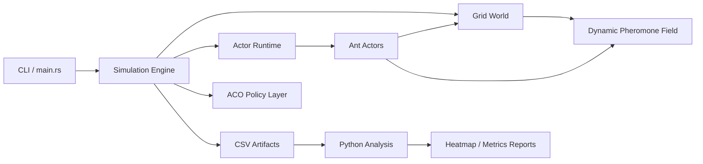
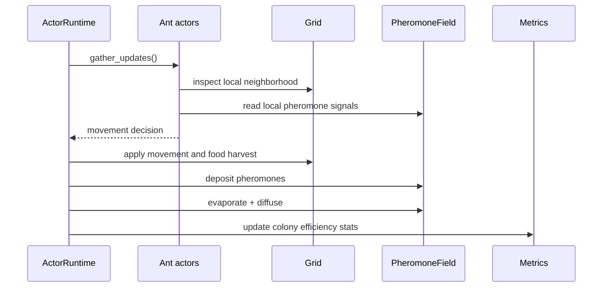

# EmpireAnts

EmpireAnts is a professional simulation baseline for studying ant colonies as a distributed adaptive system. The repository is structured as an engineering testbed rather than a toy demo: a deterministic Rust simulation core, a lightweight actor-oriented execution model, Python analysis tooling, and test coverage around pheromone dynamics and decision rules.

## Project status

- License: MIT
- Copyright: Copyright (c) 2026 mozaika228
- Primary languages: Rust and Python
- Current baseline: deterministic research-ready simulation core with analysis tooling

## Scope

- Collective intelligence and decentralized decision making
- Emergent behavior in stochastic local-rule systems
- Ant Colony Optimization inspired routing policies
- Pheromone evaporation, diffusion, and reinforcement
- Experiment-friendly metrics and offline analysis

## Architecture

```text
empireants/
|-- Cargo.toml
|-- src/
|   |-- main.rs
|   |-- lib.rs
|   |-- world/
|   |   |-- mod.rs
|   |   |-- grid.rs
|   |   `-- pheromone.rs
|   |-- ant/
|   |   |-- mod.rs
|   |   |-- ant.rs
|   |   `-- actor.rs
|   |-- simulation/
|   |   |-- mod.rs
|   |   |-- step.rs
|   |   `-- aco.rs
|   `-- render/
|       `-- mod.rs
|-- scripts/
|   |-- analyze.py
|   |-- plot_heatmap.py
|   `-- experiments.py
|-- tests/
|   |-- test_pheromone.rs
|   `-- test_ant.rs
|-- LICENSE
|-- CONTRIBUTING.md
`-- pyproject.toml
```

## System diagram



## Simulation loop



## Current capabilities

- 256 ants by default with room to scale the simulation logic further
- Grid world with food sources, obstacles, and a nest
- Local ant behavior with pheromone following and return-to-nest logic
- Dynamic pheromone field with evaporation and diffusion
- ACO strategy abstraction for Basic, Max-Min, AS-rank, and AntNet-style scoring
- CSV artifact export for metrics and pheromone snapshots
- Python scripts for metric analysis, ASCII heatmap rendering, and experiment sweeps

## Run

```bash
cargo run -- 200
python scripts/analyze.py
python scripts/plot_heatmap.py
```

The Rust binary writes:

- `artifacts/metrics.csv`
- `artifacts/pheromones.csv`

## Development workflow

```bash
cargo fmt --all
cargo test
cargo run -- 200
python -m py_compile scripts/analyze.py scripts/plot_heatmap.py scripts/experiments.py
```

## Engineering notes

- The current runtime is intentionally deterministic and single-process so that model behavior is easy to test and benchmark.
- The `ActorRuntime` is lightweight and designed as the seam for a future lock-free or sharded runtime.
- The `render` module currently emits a frame summary instead of binding directly to Bevy or `wgpu`; that keeps the baseline compileable without heavy GPU dependencies.
- The code is organized to support later additions such as Prometheus metrics, a web control plane, compute shader diffusion, and distributed colonies.

## Recommended roadmap

1. Replace the placeholder render module with a Bevy or `wgpu` realtime frontend behind a feature flag.
2. Split simulation state into chunks to support 100k+ ants without full-world contention.
3. Add benchmark targets and criterion-based performance regression tracking.
4. Expose simulation controls over HTTP or WebSocket for an educational observability layer.
5. Add biological validation datasets and replayable scenarios.

## Contributing

Contribution guidelines are documented in `CONTRIBUTING.md`.
