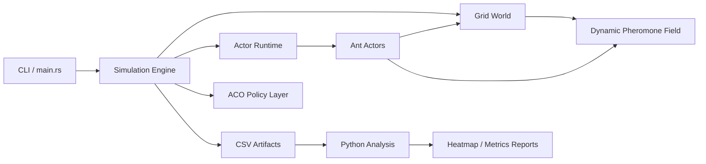
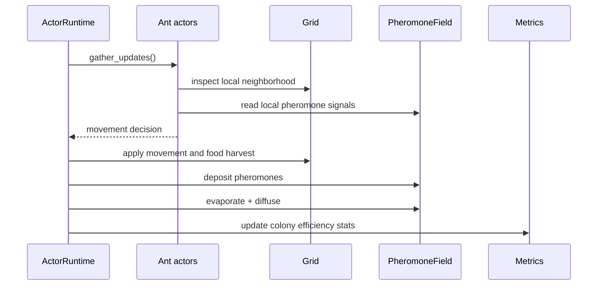
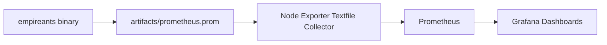

# EmpireAnts

EmpireAnts is a professional simulation baseline for studying ant colonies as a distributed adaptive system. The repository is structured as an engineering testbed rather than a toy demo: a deterministic Rust simulation core, a lightweight actor-oriented execution model, Python analysis tooling, and test coverage around pheromone dynamics and decision rules.

## Project status

- License: MIT
- Copyright: Copyright (c) 2026 mozaika228
- Primary languages: Rust and Python
- Current baseline: deterministic research-ready simulation core with analysis tooling

## Scope

- Collective intelligence and decentralized decision making
- Emergent behavior in stochastic local-rule systems
- Ant Colony Optimization inspired routing policies
- Pheromone evaporation, diffusion, and reinforcement
- Experiment-friendly metrics and offline analysis

## Architecture

```text
empireants/
|-- Cargo.toml
|-- src/
|   |-- main.rs
|   |-- lib.rs
|   |-- world/
|   |   |-- mod.rs
|   |   |-- grid.rs
|   |   `-- pheromone.rs
|   |-- ant/
|   |   |-- mod.rs
|   |   |-- ant.rs
|   |   `-- actor.rs
|   |-- simulation/
|   |   |-- mod.rs
|   |   |-- step.rs
|   |   |-- scale.rs
|   |   |-- validation.rs
|   |   `-- aco.rs
|   |-- bin/
|   |   |-- scale_benchmark.rs
|   |   |-- observability_server.rs
|   |   `-- scientific_validation.rs
|   `-- render/
|       `-- mod.rs
|-- scripts/
|   |-- analyze.py
|   |-- analyze_validation.py
|   |-- plot_heatmap.py
|   `-- experiments.py
|-- tests/
|   |-- test_pheromone.rs
|   |-- test_ant.rs
|   |-- test_observability.rs
|   |-- test_runtime.rs
|   |-- test_validation.rs
|   `-- test_scale.rs
|-- LICENSE
|-- CONTRIBUTING.md
`-- pyproject.toml
```

## System diagram



## Simulation loop



## Current capabilities

- 256 ants by default with room to scale the simulation logic further
- Grid world with food sources, obstacles, and a nest
- Local ant behavior with pheromone following and return-to-nest logic
- Dynamic pheromone field with evaporation and diffusion
- ACO strategy abstraction for Basic, Max-Min, AS-rank, and AntNet-style scoring
- actor runtime with mailbox backpressure, supervision events, and controlled actor recovery
- CSV artifact export for metrics and pheromone snapshots
- Prometheus-compatible metric export for observability pipelines
- scale benchmark profiles for `10k`, `100k`, and `1m` ants
- scientific validation suite with scenario-strategy matrix and reproducible KPI report
- Python scripts for metric analysis, ASCII heatmap rendering, and experiment sweeps

## Run

```bash
cargo run -- 200
python scripts/analyze.py
python scripts/plot_heatmap.py
```

The Rust binary writes:

- `artifacts/metrics.csv`
- `artifacts/pheromones.csv`
- `artifacts/ants.csv`
- `artifacts/prometheus.prom`

## Observability

EmpireAnts now emits a Prometheus textfile-compatible snapshot on every CLI run. This allows a node exporter textfile collector, CI artifact parser, or custom dashboard bridge to ingest the colony state without linking extra Rust dependencies.

For live dashboards, use the dedicated HTTP endpoint server:

```bash
cargo run --release --bin observability_server -- 127.0.0.1:9109 100000 384 384
```

- `GET /metrics`: Prometheus metrics stream
- `GET /healthz`: readiness and liveness probe

Minimal Prometheus scrape config:

```yaml
scrape_configs:
  - job_name: empireants
    scrape_interval: 2s
    static_configs:
      - targets: ["127.0.0.1:9109"]
```

Tracked observability signals include:

- colony throughput: steps executed and food collected
- behavior quality: exploration moves and average decision score
- simulation latency: last/average/max step duration in microseconds
- runtime state: ants carrying food, searching, returning, and average energy
- runtime resilience: mailbox depth, dropped messages, supervision events, restart counters
- environment dynamics: active food sources and peak pheromone intensity

Example metrics pipeline:



## Development workflow

```bash
cargo fmt --all
cargo test
cargo run -- 200
cargo run --release --bin scale_benchmark
cargo run --release --bin scale_benchmark 100k 200
cargo run --release --bin scientific_validation
python scripts/analyze_validation.py
python -m py_compile scripts/analyze.py scripts/plot_heatmap.py scripts/experiments.py
```

## Scientific validation

Scientific validation is implemented as a deterministic matrix:

- scenarios: `open_field`, `narrow_passages`, `obstacle_shift`
- strategies: `basic`, `max_min`, `as_rank`, `ant_net`
- KPIs: food collection, first food step, convergence proxy, exploration efficiency, throughput, runtime stability

Run:

```bash
cargo run --release --bin scientific_validation
python scripts/analyze_validation.py
```

Artifacts:

- `artifacts/validation_report.csv`

## Real scaling benchmark

The `scale_benchmark` binary is designed for throughput profiling on large colonies:

- profile `10k`: warm-up profile for local tuning
- profile `100k`: stress profile for CPU scheduling and memory pressure
- profile `1m`: high-load profile for near-production benchmarking

Example:

```bash
cargo run --release --bin scale_benchmark
```

Output format:

```text
scale_profile=100k ants=100000 steps=250 elapsed_s=... steps_per_s=... ant_updates_per_s=... est_memory_mb=...
```

This gives a reproducible baseline for comparing runtime optimizations and regression checks in CI.

## Engineering notes

- The current runtime is intentionally deterministic and single-process so that model behavior is easy to test and benchmark.
- The `ActorRuntime` is lightweight and designed as the seam for a future lock-free or sharded runtime.
- The `render` module currently emits a frame summary instead of binding directly to Bevy or `wgpu`; that keeps the baseline compileable without heavy GPU dependencies.
- The observability layer currently exports snapshots to disk; a live HTTP metrics endpoint can be added later without breaking the current API seams.
- The code is organized to support later additions such as Prometheus metrics, a web control plane, compute shader diffusion, and distributed colonies.

## Recommended roadmap

1. Replace the placeholder render module with a Bevy or `wgpu` realtime frontend behind a feature flag.
2. Split simulation state into chunks to support 100k+ ants without full-world contention.
3. Add benchmark targets and criterion-based performance regression tracking.
4. Expose simulation controls over HTTP or WebSocket for an educational observability layer.
5. Add biological validation datasets and replayable scenarios.

## Contributing

Contribution guidelines are documented in `CONTRIBUTING.md`.
