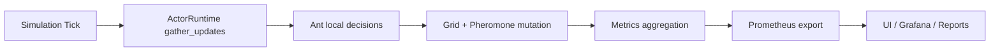

# Architecture Specification

## Purpose

EmpireAnts is designed as a deterministic simulation platform for studying decentralized decision making and emergent behavior in ant-colony inspired systems.

## Logical subsystems

1. `world`
Grid topology, obstacles, nest, and food state transitions.
2. `ant`
Per-agent local behavior and actor-runtime command processing.
3. `simulation`
Tick orchestration, strategy policy, scale profiles, and validation suite.
4. `observability`
Metric model and Prometheus encoding.
5. `bin`
Operational entry points (`main`, scaling, validation, metrics server, UI server).
6. `ui`
Realtime browser dashboard for operational and research visibility.

## Data flow

## Runtime contract

- Tick order is deterministic within a single process.
- World mutations are centralized in `simulation::step`.
- Actor recovery and supervision are runtime-level concerns, not ant-level behavior.
- Observability counters must be monotonic where semantically required.

## Invariants

- Obstacle cells are non-walkable.
- Ant IDs are stable during process lifetime.
- `food_collected` is non-decreasing.
- Runtime counters (`dropped`, `restarts`, `supervision_events`) are non-decreasing.

## Failure model

- Decision panic or invalid decision score triggers supervision path.
- Recovery can re-home an ant to nest and reset state.
- Backpressure drops mailbox commands when capacity is exceeded.

## Deployment topology

- Local binary mode for experimentation.
- Product mode via `docker-compose`:
  - `observability_server`
  - `ui_server`
  - `prometheus`
  - `grafana`
